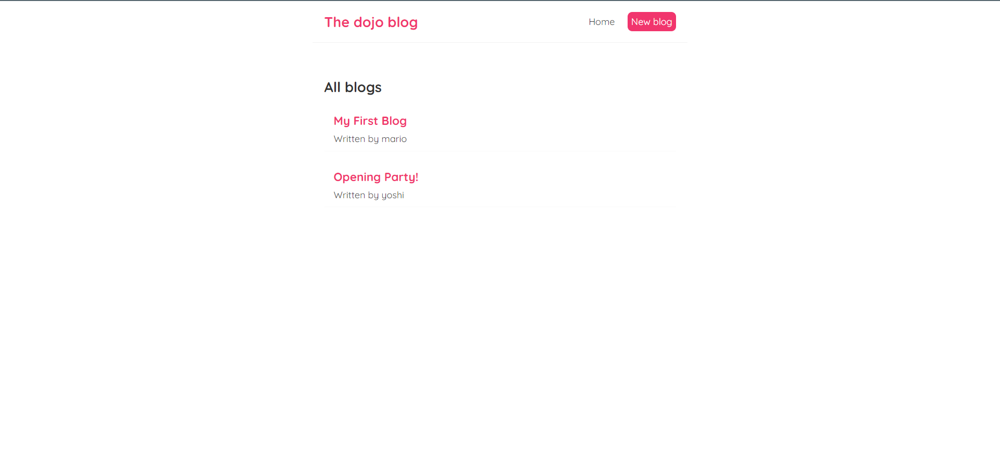
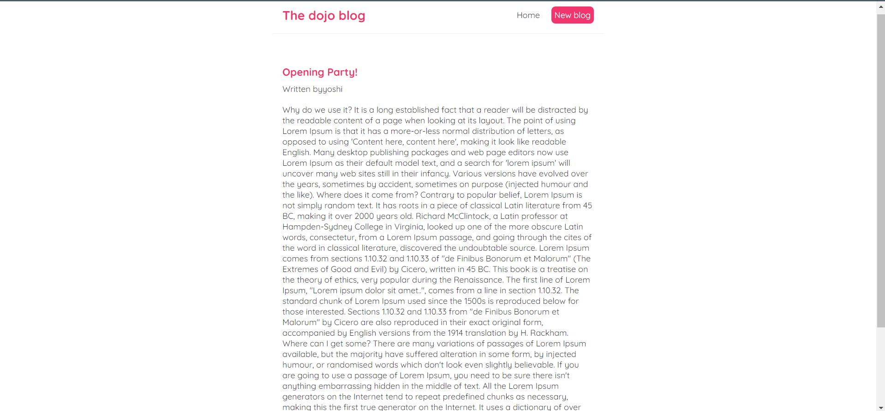
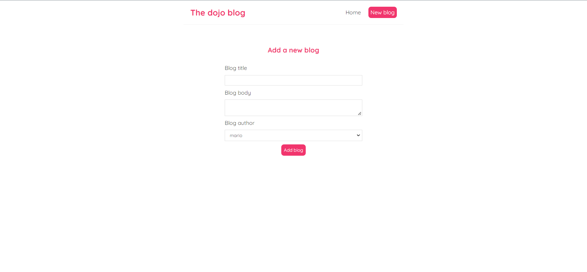

<div align="center">

# Dojo blog

<div align="center">

[](https://github.com/Abd-ELrahmanHamza/dojo-blog/contributors)
[](LICENSE)
[](https://github.com/Abd-ELrahmanHamza/dojo-blog/network)
[](https://github.com/Abd-ELrahmanHamza/dojo-blog/stargazers)
[](https://github.com/Abd-ELrahmanHamza/dojo-blog/issues)

</div>
</div>

## Description

A mini blog where you can list differente articles, delete article, Add new article built using **React**

## Screenshots





## Getting Started

### Installing

```
git clone https://github.com/Abd-ELrahmanHamza/dojo-blog
```

### Executing program

#### `npm start`

Runs the app in the development mode.\
Open [http://localhost:3000](http://localhost:3000) to view it in your browser.

The page will reload when you make changes.\
You may also see any lint errors in the console.

## Contributors

<table>
  <tr>

<td align="center">
<a href="https://github.com/Abd-ELrahmanHamza" target="_black">
<br /><sub><b>Abdelrahman Hamza</b></sub></a><br />
</td>

</tr>
 </table>

## License

This project is licensed under the [MIT] License - see the [LICENSE.md](LICENSE) file for details
